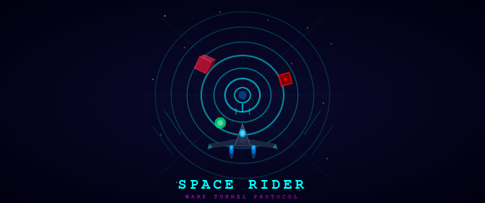

# VS Code Space Rider

A futuristic 3D tunnel flyer game for VS Code. Pilot your ship through an endless neon warp tunnel, dodge obstacles, collect energy orbs, and chase the high score - all without leaving your editor.

`Ctrl + click` to play [game.html](index.html) in the browser.

## Features

- **3D WebGL rendering** -- Custom inline WebGL engine with no external dependencies. Runs entirely inside a VS Code webview panel.
- **Neon warp tunnel** -- Fly through a procedurally generated tunnel with pulsing neon ring effects and fog.
- **Ship controls** -- Steer, boost, barrel roll, and fire a pulse cannon.
- **Obstacles and mines** -- Dodge rotating obstacle blocks and blinking mines that deal shield damage on contact.
- **Energy orbs** -- Collect glowing orbs to gain score and restore shield.
- **Progressive difficulty** -- Speed gradually increases with distance. Obstacle density grows every minute. Mines begin spawning after the first minute and escalate over time.
- **HUD** -- Live score, distance traveled, and shield percentage with a shield bar.
- **Debug mode** -- Five test scenarios accessible via a dedicated command for isolated gameplay testing.

## Getting Started

### Prerequisites

- [VS Code](https://code.visualstudio.com/) v1.85.0 or later
- [Node.js](https://nodejs.org/) (for building from source)

### Install from source

```bash
git clone <repository-url>
cd space-rider
npm install
npm run compile
```

Then press `F5` in VS Code to launch the Extension Development Host, or package the extension with:

```bash
npx @vscode/vsce package
```

and install the resulting `.vsix` file.

## Usage

Open the Command Palette (`Ctrl+Shift+P` / `Cmd+Shift+P`) and run:

| Command | Description |
|---|---|
| **Space Rider: Launch Game** | Start the game in normal mode |
| **Space Rider: Debug** | Open the debug scenario menu |

### Controls

| Input | Action |
|---|---|
| `W` / `A` / `S` / `D` or Arrow keys | Steer ship |
| `Shift` | Boost |
| `Space` | Fire pulse cannon |
| `Q` / `E` | Barrel roll left / right |
| `Enter` | Launch / relaunch |

### Gameplay

- **Dodge obstacles** -- Red rotating blocks deal 25 shield damage.
- **Avoid mines** -- Blinking red cubes deal 35 shield damage. They take 5 pulse hits to destroy.
- **Collect energy orbs** -- Green glowing orbs restore 10 shield and award 500 points.
- **Destroy targets** -- Shooting obstacles awards 200 points; destroying mines awards 500 points.
- **Survive** -- The game ends when shield reaches 0.

### Debug Modes

Run **Space Rider: Debug** to access five isolated test scenarios:

| # | Mode | Description |
|---|---|---|
| 1 | **Mine Field** | Only mines. Pure evasion. |
| 2 | **Orb Harvest** | Only orbs. Collect them all. |
| 3 | **Collision Course** | Hit obstacles. Track every impact. |
| 4 | **Mine Sweeper** | Ram mines. Log collisions. |
| 5 | **Chaos Protocol** | Everything at once with permanent boost and auto-fire. |

Navigate with arrow keys or number keys, then press `Enter` to launch.

## Project Structure

```
space-rider/
  src/
    extension.ts    # Extension entry point, registers commands and manages the webview panel
  media/
    game.html       # Complete game implementation (HTML + CSS + inline WebGL engine + game logic)
  package.json      # Extension manifest with commands and metadata
  tsconfig.json     # TypeScript configuration
```

## Development

```bash
npm run compile    # Build the TypeScript source
npm run watch      # Watch mode for development
npm run lint       # Run ESLint on the src directory
```

## How It Works

The extension registers two commands (`spaceRider.start` and `spaceRider.debug`) that open a VS Code webview panel. The webview loads `media/game.html`, which contains a self-contained WebGL game engine built from scratch to avoid CSP and CDN issues inside VS Code webviews. The engine includes its own matrix math, shader compilation, geometry builders (boxes, spheres, tunnel rings), and a main render loop.

When launched in debug mode, the extension injects a flag into the HTML that triggers the debug scenario menu on load. The webview communicates back to the extension host via `postMessage` to display the final score as a VS Code notification.
